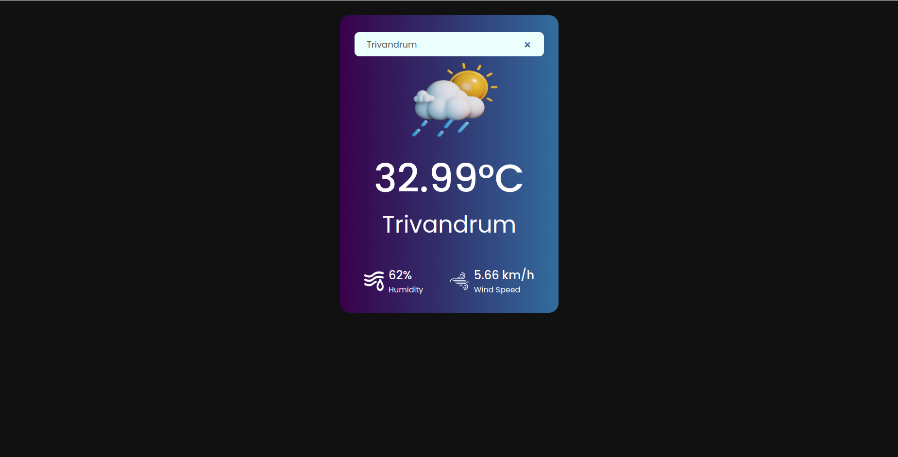

## [LIVE  👁️](https://weather-app-virid-sigma-20.vercel.app/)

## [Demo ▶](https://www.youtube.com/watch?v=Rw3obnGNbNU)

# Weather App

This is a simple weather application built using React. It allows users to search for weather information based on location.

## Features

- Search for weather information by location.
- Display current weather conditions including temperature, humidity, and wind speed.

## Installation

To run this application locally, follow these steps:

1. Clone this repository to your local machine:

## Available Scripts

In the project directory, you can run:

### `npm install`

### `npm start`

Runs the app in the development mode.\
Open [http://localhost:3000](http://localhost:3000) to view it in your browser.

The page will reload when you make changes.\
You may also see any lint errors in the console.

## Screenshots

